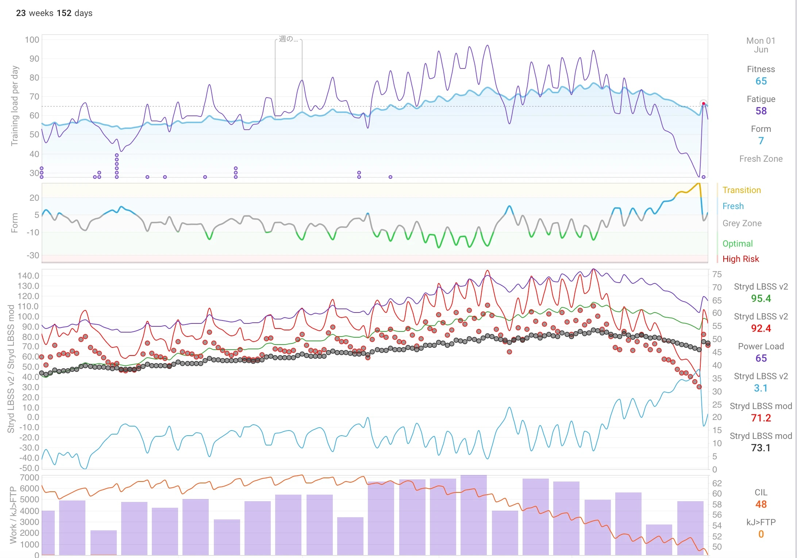

English | [日本語](README.ja.md)

# Intervals.icu MCP Server — for Stryd runners

In plain terms: this lets an AI assistant like Claude read your Intervals.icu
training data and act as an analysis partner — with all the numbers computed by
tested code, not guessed by the AI.



*Top: power (RSS)-based PMC. Bottom: impact (LBSS)-based PMC — same athlete, two
different loads tracked side by side.*

An [Intervals.icu](https://intervals.icu) MCP (Model Context Protocol) server built
for **Stryd runners** — power-based running analysis (a dual Performance Management
Chart with RSS, LBSS), designed so the LLM never does the
math. The deterministic numbers (PMC values, cardiac decoupling, ramp rates) are
computed server-side; the AI client (Claude Desktop, Codex, …) is left to interpret,
not to guess.

It is designed to run **locally, for a single athlete (you)** — not as a hosted,
multi-user service.

## What it does

- **Stryd extension (the reason this exists).** A second Performance Management Chart
  computed server-side from a lower-body load metric — **LBSS** (Lower Body Stress
  Score) — via EMA, sitting next to Intervals.icu's built-in RSS-based PMC. You get a
  **dual PMC** (musculoskeletal load *and* metabolic load), ILR (Impact Loading Rate)
  trends, and weekly / phase-level summaries aimed at ultramarathon-style review. The
  LBSS / ILR custom-field names are configurable (`LBSS_FIELD` / `ILR_FIELD`, default
  `StrydLBSSv2` / `StrydILR`) so a recalibrated or renamed field needs no code change —
  see [INSTALL.md](INSTALL.md#setting-up-the-stryd-custom-fields-optional) and the
  [field recipes](https://github.com/methylone/Intervals-MCP-Server-with-STRYD/wiki/LLM-Agent-Recipes).
  `estimate_critical_impact` reverse-estimates Stryd's Critical Impact from your
  Intervals streams and Critical Power (no Stryd API), so LBSS calibration stays
  self-contained.
- **Core (any Intervals.icu user).** List and inspect activities, wellness, HRV
  trends, events / planned workouts (read + create / update / delete), athlete
  summaries, and stream-level analysis (splits, cardiac decoupling, grade-adjusted
  pace, custom power/HR zones).

The server provides **data and math only**. It does **not** decide how you should
train — that interpretation comes from a knowledge file *you* write and load into your
AI client. See [`training-knowledge-template/`](training-knowledge-template/).

## Race report

I also wrote a race report about how this tool came to be and how it was tested in the Nara 100 km Ultramarathon:

[From building this tool to testing it in the Nara 100 km Ultramarathon](https://note.com/methylone/n/n6bc221063fe3?hl=en)

## Quick start

Not sure where to start? Paste this repository's URL into Claude (or your AI
assistant of choice) and ask it to walk you through setup — see
[Let an AI install it](INSTALL.md#let-an-ai-install-it) for the two-step version.

Pick the install path that matches your client. Full steps and prerequisites:
[INSTALL.md](INSTALL.md).

### 1. MCPB bundle — Claude Desktop (easiest)

Download the `.mcpb` bundle from the
[latest release](https://github.com/methylone/Intervals-MCP-Server-with-STRYD/releases),
double-click to install into Claude Desktop, and fill in the three fields it asks for
(Athlete ID, API key, timezone). Your API key is stored in the **OS keychain**, not in
a plaintext file.

### 2. npx — one-line config (Claude Desktop / Codex / any MCP client)

No clone, no build. Point your client at the published npm package:

```json
{
  "mcpServers": {
    "intervals-stryd": {
      "command": "npx",
      "args": ["-y", "intervals-mcp-with-stryd"],
      "env": {
        "INTERVALS_ATHLETE_ID": "i0000000",
        "INTERVALS_API_KEY": "your-api-key",
        "ATHLETE_TIMEZONE": "Asia/Tokyo",
        "CACHE_DIR": "/absolute/path/to/intervals-cache"
      }
    }
  }
}
```

`CACHE_DIR` is optional but recommended under npx: without it the stream cache lands in
npx's volatile package cache. See [INSTALL.md](INSTALL.md#install-via-npx).

### 3. From source / Docker (development, HTTP mode)

```bash
git clone https://github.com/methylone/Intervals-MCP-Server-with-STRYD.git
cd Intervals-MCP-Server-with-STRYD
npm install
cp .env.example .env      # then fill in your API key, athlete ID, timezone
npm run build
```

Then point your client at `build/index.js` over stdio, or run HTTP / Docker — see
[INSTALL.md](INSTALL.md). New to this? Hand the repo URL to your AI client and ask it to
walk you through installation using the README and INSTALL.md.

## Try it now

Once it's installed, you don't need a knowledge file or any Stryd custom fields to
get started — just ask. A few things you can say right away:

- *"Summarize my training this week."*
- *"What's my PMC today, and how's my form trending?"*
- *"Show me yesterday's run splits and cardiac decoupling."*

A quick example:

> **You:** What's my PMC today?
>
> **Claude:** Fitness (CTL) is 50, Fatigue (ATL) is 40, so Form (TSB) is +10 — you're
> fresh. Fitness has been climbing steadily over the last three weeks while Fatigue
> has stayed flat, so the current ramp looks sustainable rather than a spike.

Want deeper, personalized coaching that reflects *your* own training philosophy? →
[`training-knowledge-template/`](training-knowledge-template/) lets you teach your AI
client how you like to train.

## Command-line use

The same tools are also available from a shell via the `intervals-mcp` CLI (no MCP
client, no LLM) — useful for automation, piping into `jq`, and quick checks. It returns
raw data only; it does **not** apply the methodology. See [docs/CLI.md](docs/CLI.md).

## Documentation

- [INSTALL.md](INSTALL.md) — prerequisites and client setup (MCPB / npx / source)
- [docs/CLI.md](docs/CLI.md) — running the tools from a shell
- [ARCHITECTURE.md](ARCHITECTURE.md) — code layout and how to extend it
- [SECURITY.md](SECURITY.md) — **security & privacy model**: what it connects to,
  what it reads/writes, where your key and cache live, HTTP mode
- [ROADMAP.md](ROADMAP.md) — what's planned next
- [BACKGROUND.md](BACKGROUND.md) — why this exists and the design principles behind it
- [`training-knowledge-template/`](training-knowledge-template/) — build your own
  analysis knowledge for your AI client

## Security & privacy

It talks to **one** host (intervals.icu), writes **only to your Intervals.icu calendar
events**, never logs your API key, and ships **no telemetry**. The HTTP transport has
**no application-layer authentication** — run locally over stdio (or MCPB / npx) for
personal use and never expose HTTP mode to the public internet. Full details — cache
contents, key blast radius, build verification, uninstall — in
[SECURITY.md](SECURITY.md).

## Contributing

Forks are welcome — take it and make it yours. Pull requests are not actively
maintained, so please fork freely rather than expecting timely reviews.

## License

[AGPL-3.0-or-later](LICENSE). In short: you're free to use, modify, and run this,
including commercially — but if you distribute it or run a modified version as a network
service, you must release your source under the same license. It cannot be turned into a
closed, proprietary product.
